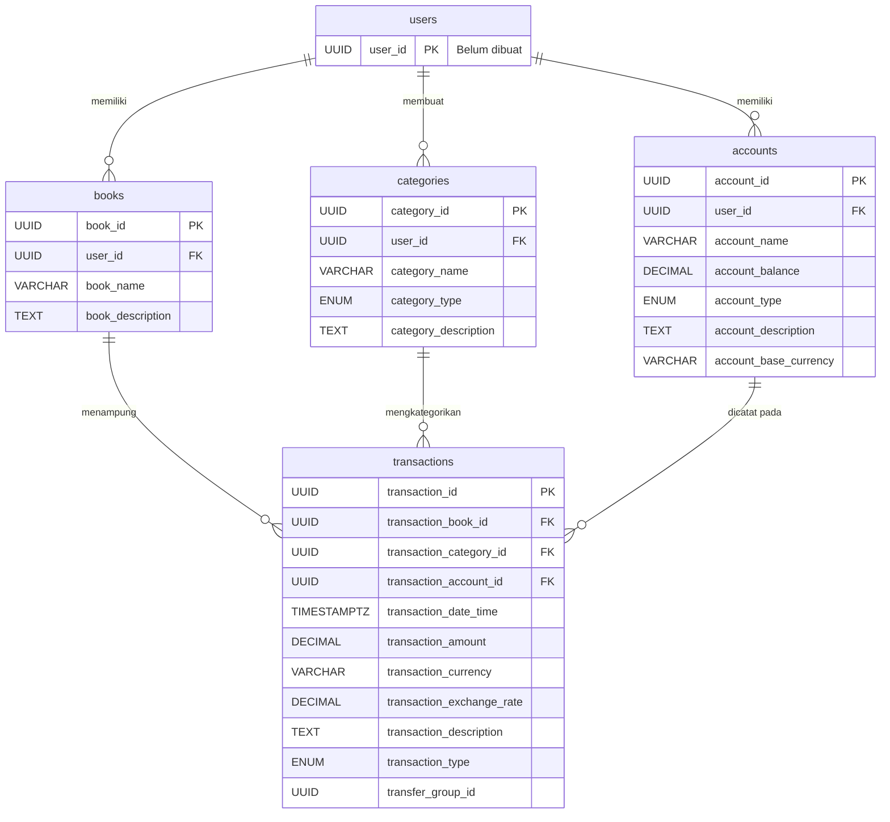

## Tabel Account
| Nama Kolom | Tipe Data | Atribut | Deskripsi |
|---|---|---|---|
| account_id | UUID | PRIMARY KEY, DEFAULT gen_random_uuid() | ID dari Account |
| user_id | UUID | FOREIGN KEY | ID dari pemilik Account ini, satu user bisa punya banyak Account |
| account_name | VARCHAR(100) | NOT NULL | Nama dari Account |
| account_balance | DECIMAL(20, 4) | NOT NULL | Jumlah saldo di Account ini |
| account_type | ENUM | NOT NULL | Tipe dari Account, bisa berupa Cash, Bank, Credit Card, E-Wallet, Investment, Assets, Piutang, Utang, dll |
| account_description | TEXT | NULL | Deskripsi dari Account ini |
| account_base_currency | VARCHAR(3) | NOT NULL | Mata uang default dari Account ini |

## Tabel Transactions (Buku Kas)
| Nama Kolom | Tipe Data | Atribut | Deskripsi |
|---|---|---|---|
| transaction_id | UUID | PRIMARY KEY, DEFAULT gen_random_uuid() | ID dari Transaction |
| transaction_book_id | UUID | FOREIGN KEY | ID dari Book Transaction ini, satu Book bisa punya banyak Transaction |
| transaction_category_id | UUID | FOREIGN KEY | ID dari Category Custom user |
| transaction_account_id | UUID | FOREIGN KEY | ID dari Account tempat transaksi ini terjadi |
| transaction_date_time | TIMESTAMPZ | NOT NULL DEFAULT now() | Waktu terjadinya Transaction |
| transaction_amount | DECIMAL(20, 4) | NOT NULL | Jumlah dari Transaction |
| transaction_currency | VARCHAR(3) | NOT NULL | Mata uang dari Transaction |
| transaction_exchange_rate | DECIMAL(18, 9) | NOT NULL | Nilai tukar dari Transaction |
| transaction_description | TEXT | NULL | Deskripsi dari Transaction |
| transaction_type | ENUM | NOT NULL | Tipe dari Transaction: EXPENSE, INCOME, TRANSFER_OUT, atau TRANSFER_IN |
| transfer_group_id | UUID | NULL | ID pengikat untuk Transfer. 1 Transfer = 2 baris (TRANSFER_OUT & TRANSFER_IN) dengan ID grup yang sama. |

## Tabel Category (Kategori Transaksi)
| Nama Kolom | Tipe Data | Atribut | Deskripsi |
|---|---|---|---|
| category_id | UUID | PRIMARY KEY, DEFAULT gen_random_uuid() | ID dari Category |
| user_id | UUID | FOREIGN KEY | ID dari pemilik Category ini, satu user bisa punya banyak Category |
| category_name | VARCHAR(100) | NOT NULL | Nama dari Category |
| category_type | ENUM | NOT NULL | Tipe kategori: EXPENSE atau INCOME. Membantu UI saat merender dropdown. |
| category_description | TEXT | NULL | Deskripsi dari Category ini |

## Tabel Book (Buku Transaksi)
| Nama Kolom | Tipe Data | Atribut | Deskripsi |
|---|---|---|---|
| book_id | UUID | PRIMARY KEY, DEFAULT gen_random_uuid() | ID dari Book |
| user_id | UUID | FOREIGN KEY | ID dari pemilik Book ini, satu user bisa punya banyak Book |
| book_name | VARCHAR(100) | NOT NULL | Nama dari Book |
| book_description | TEXT | NULL | Deskripsi dari Book ini |

## Diagram Relasi Database (ERD)

